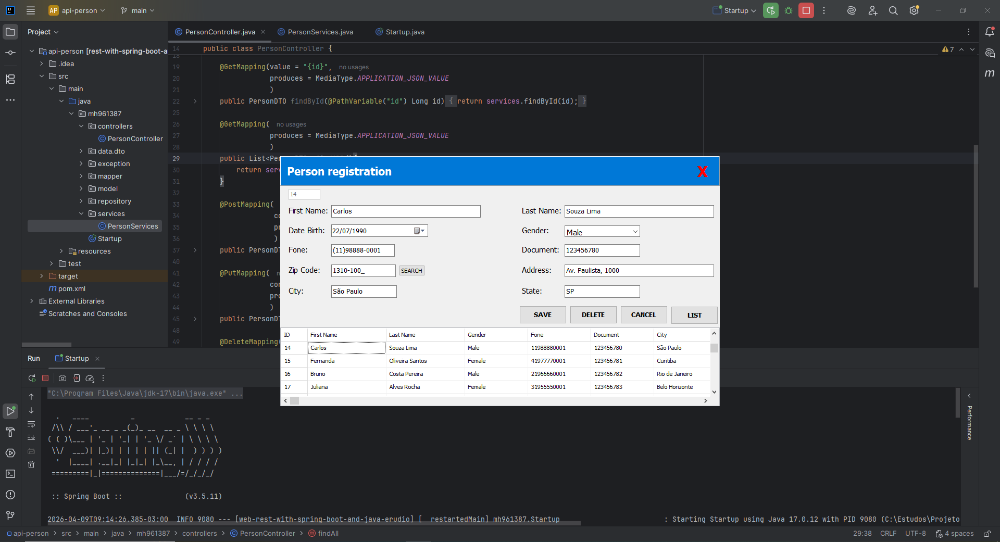

# 🚀 Person Management System

Sistema full stack para gerenciamento de pessoas, desenvolvido com
**Java (Spring Boot)** no backend e **Delphi (VCL)** no frontend,
realizando comunicação via API REST.

------------------------------------------------------------------------

## 📌 Sobre o projeto

Este projeto tem como objetivo demonstrar a integração entre tecnologias
distintas (Java + Delphi), implementando um CRUD completo com boas
práticas de arquitetura, validação de regras de negócio e automação de
mapeamento de dados.

------------------------------------------------------------------------

## 🧠 Funcionalidades

-   Cadastro de pessoas\
-   Listagem em grid (Delphi)\
-   Edição de registros (PUT)\
-   Exclusão com confirmação (DELETE)\
-   Validação de documento duplicado\
-   Preenchimento automático de endereço via CEP\
-   Mapeamento automático com RTTI (Delphi)\
-   Tratamento global de exceções (Spring Boot)

------------------------------------------------------------------------

## 🛠️ Tecnologias utilizadas

### Backend

-   Java 17\
-   Spring Boot\
-   JPA / Hibernate\
-   MySQL

### Frontend

-   Delphi VCL\
-   Consumo de API REST\
-   RTTI

------------------------------------------------------------------------

## 📡 Endpoints

GET /person\
GET /person/{id}\
POST /person\
PUT /person\
DELETE /person/{id}

------------------------------------------------------------------------

## ⚙️ Como executar

### Backend

mvn spring-boot:run

### Frontend

Abrir projeto Delphi e executar

------------------------------------------------------------------------

## 📸 Screenshots

------------------------------------------------------------------------

## 💡 Destaques

-   Integração Java + Delphi\
-   Uso de RTTI\
-   Arquitetura em camadas\
-   Tratamento de exceções

------------------------------------------------------------------------

## 📄 Licença

Uso livre para estudos.
